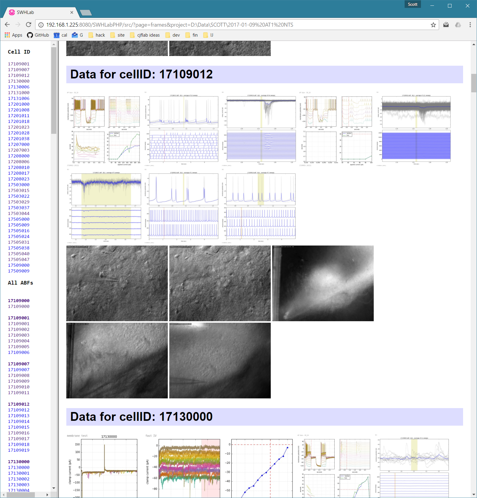

# SWHLabPHP
SWHLabPHP is a cross-platform PHP-centric data browser designed to provide a web front-end to easily explore electrophysiology project data (analyzed by SWHLab) residing on a local network. This software was written with emphasis on [ABF files](http://mdc.custhelp.com/app/answers/detail/a_id/18881/~/axon%E2%84%A2-pclamp%C2%AE-abf-file-support-pack-download-page) and microscopy file formats (fluorescent micrographs, time series, 3d stacks, etc) but can be easily modified to allow browing of other file formats. The intended use of this software is to allow quick browsing of data served on the local network in real time as experiments are being performed. SWHLabPHP assumes you are running a modern version of Apache and PHP.

## Screenshots
### Design / Mock-up


### Barebones Template (functional)


## Windows 10 setup
I developed this on Windows 10 by installing [WAMP server](https://sourceforge.net/projects/wampserver/) (version [3.0.6](https://www.google.com/search?q=wampserver3.0.6_x64_apache2.4.23_mysql5.7.14_php5.6.25-7.0.10.exe)). After installation, I made a few modifications to core apache files:

**httpd-vhosts.conf** modified to change port number and allow more than local access (allowing web server to be accessed over LAN)

```
<VirtualHost *:8080>
	ServerName localhost
	DocumentRoot c:/wamp64/www
	IndexOptions NameWidth=*
	<Directory  "c:/wamp64/www/">
		Options +Indexes +Includes +FollowSymLinks +MultiViews
		AllowOverride All
		Require all granted
	</Directory>
</VirtualHost>
```

**httpd.conf** modified to change port number and force serving on the LAN ip (192.x.x.x) and not the department network (10.x.x.x)
```
...
#ServerName localhost:8080
ServerName 192.168.1.225:8080
...
#Listen 12.34.56.78:80
#Listen 0.0.0.0:80
#Listen [::0]:80
#Listen 192.168.1.225:80
Listen 192.168.1.225:8080
...
```

## Developing with GitHub
* Clone this package into `C:\wamp64\www\SWHLabPHP`
* If serving off a network drive (SMB on Windows), add an alias virtual directory using FORWARD SLASHES (!!!!!) backslashes will cause a "Forbidden" error.
* My working virtual network drive (so `/dataX/SCOTT/` pulls from `X:/Data/SCOTT/`) is as follows:

 ```
 Alias /dataX "//spike/X_Drive/Data/"

<Directory "//spike/X_Drive/Data/">
	Options Indexes FollowSymLinks MultiViews
  AllowOverride all
  <ifDefine APACHE24>
		Require local
	</ifDefine>
	<ifDefine !APACHE24>
		Order Allow,Deny
    Allow from all
	</ifDefine>
</Directory>
 ```

## Network Share Notes
```
Alias /xmirror "//192.168.1.100/X_Mirror/Data/"
<Directory "//192.168.1.100/X_Mirror/Data/">
  Options Indexes FollowSymLinks MultiViews
  AllowOverride all
  <ifDefine APACHE24>
        Require all granted
	</ifDefine>
	<ifDefine !APACHE24>
		Order Allow,Deny
        Allow from all
	</ifDefine>
</Directory>
```
## System-wide import ability
Inside the `/SWHLabPHP/` folder I try to exclusively use relative imports (with respect to `swhlab.php`). If you want to develop scripts outside `/SWHLabPHP/`, relative imports don't always make sense. Therefore, I establish an environment variable using `.htaccess` in the root web folder pointing to the location of the folder containing `swhlab.php` relative to `DOCUMENT_ROOT`.

**```.htaccess```**
```
SetEnv SWHLABPHP_ROOT /SWHLabPHP/src/
```

**```anywhere.php```**
```
<?php include($_SERVER['DOCUMENT_ROOT'].getenv('SWHLABPHP_ROOT')."swhlab.php"); ?>
<?php html_top();?><h1>THIS IS WORKING</h1><?php html_bot();?>
```
